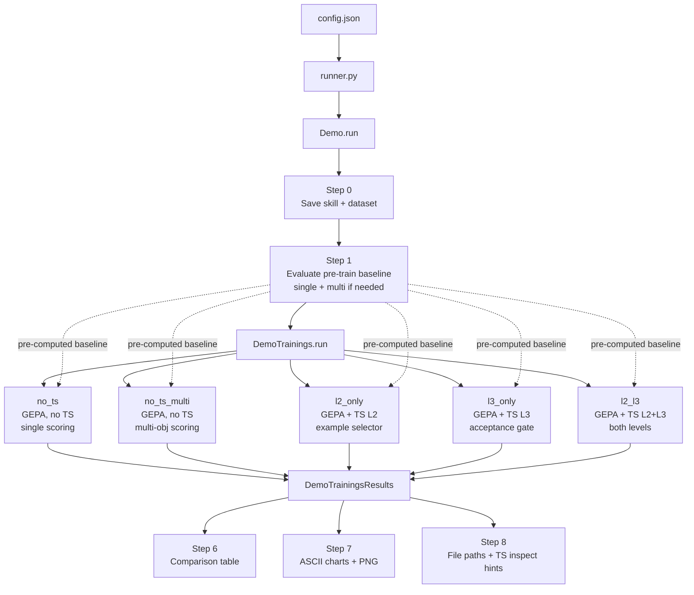
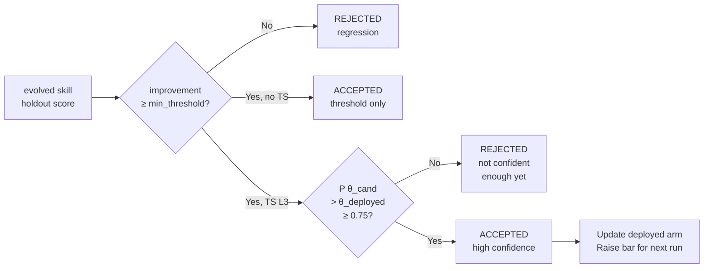
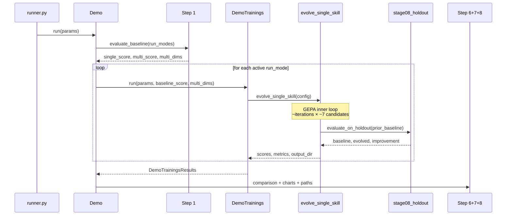
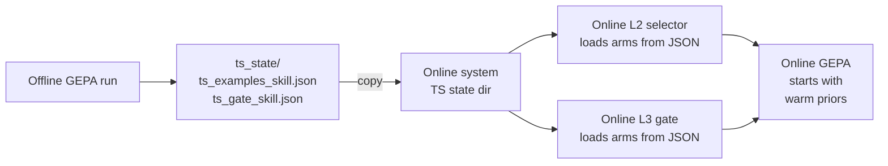

# GEPA + Thompson Sampling — Offline Benchmark

A side-by-side comparison framework that evolves an agent skill with **GEPA** across five run modes, varying how Thompson Sampling (TS) is used.  Produces terminal charts, a matplotlib PNG, and persistable TS state files that can seed an online system.

---

## Table of Contents

1. [Quick Start](#quick-start)
2. [High-Level Architecture](#high-level-architecture)
3. [Run Modes](#run-modes)
4. [How GEPA Works](#how-gepa-works)
5. [Thompson Sampling — Three Levels](#thompson-sampling--three-levels)
6. [Scoring Modes — Single vs Multi-Objective](#scoring-modes--single-vs-multi-objective)
7. [Step-by-Step Execution Flow](#step-by-step-execution-flow)
8. [Configuration Reference](#configuration-reference)
9. [Output Files](#output-files)
10. [Scenarios](#scenarios)
11. [Good Usage Patterns](#good-usage-patterns)
12. [Reusing Offline TS State Online](#reusing-offline-ts-state-online)

---

## Quick Start

```bash
# Edit config.json first (set api_key, model, run_modes, scenarios)
python runner.py
```

```json
// config.json — minimal example
{
  "scenarios":    ["rtos-review"],
  "run_modes":    ["no_ts", "no_ts_multi"],
  "api_key":      "sk-...",
  "model":        "deepseek/deepseek-chat",
  "api_base":     "https://api.deepseek.com",
  "iterations":   5,
  "ts_batch_size": 4,
  "n_runs":       1,
  "verbose":      false
}
```

| Parameter | Effect |
|-----------|--------|
| `scenarios` | Which scenarios to run (can be a list) |
| `run_modes` | Which training passes to execute (see [Run Modes](#run-modes)) |
| `iterations` | GEPA inner-loop iterations (more = slower, better skill) |
| `ts_batch_size` | How many examples Level-2 TS selects per batch |
| `n_runs` | Independent GEPA runs per mode (≥3 for statistical significance) |

---

## High-Level Architecture

### Mermaid diagram



### ASCII architecture

```
 ┌─────────────────────────────────────────────────────────────────────┐
 │                         OFFLINE RUN                                 │
 │                                                                     │
 │  config.json ──► runner.py ──► Demo.run(params)                    │
 │                                     │                              │
 │                          ┌──────────▼──────────┐                   │
 │                          │  Step 1: Baseline    │                   │
 │                          │  ─ single LLM judge  │                   │
 │                          │  ─ multi-obj judge   │ (if no_ts_multi   │
 │                          │    (5 dimensions)    │  in run_modes)    │
 │                          └──────────┬──────────┘                   │
 │                                     │ baseline scores              │
 │              ┌──────────────────────┼──────────────────────┐       │
 │              ▼                      ▼                      ▼       │
 │        ┌──────────┐          ┌──────────┐          ┌──────────┐   │
 │        │  no_ts   │          │ l2_only  │          │  l2_l3   │   │
 │        │  (GEPA,  │          │ (GEPA +  │          │ (GEPA +  │   │
 │        │  no TS)  │          │  TS L2)  │          │ TS L2+L3)│   │
 │        └────┬─────┘          └────┬─────┘          └────┬─────┘   │
 │             │                     │                      │         │
 │        ┌────▼─────────────────────▼──────────────────────▼──────┐ │
 │        │           Step 6: Comparison table                      │ │
 │        │  Pre-S  Pre-M  No-TS  No-TS-Multi  L2-only  ...         │ │
 │        │  0.44   0.65   0.64   0.73         0.71     ...         │ │
 │        └──────────────────────────────────────────────────────┬──┘ │
 │                                                               │     │
 │                                           ┌───────────────────▼───┐ │
 │                                           │ Step 7: ASCII + PNG   │ │
 │                                           └───────────────────────┘ │
 └─────────────────────────────────────────────────────────────────────┘
```

---

## Run Modes

All modes evolve the **same baseline skill** starting from the same pre-training score. The only difference is *how* GEPA is guided.

| Mode | TS L2 Selector | TS L3 Gate | Scoring | What it tests |
|------|:--------------:|:----------:|---------|---------------|
| `no_ts` | — | — | single | Pure GEPA baseline |
| `no_ts_multi` | — | — | multi (5-dim) | Multi-objective GEPA, no TS |
| `l2_only` | ✓ | — | single | Budget allocation via TS |
| `l3_only` | — | ✓ | single | Confidence gating via TS |
| `l2_l3` | ✓ | ✓ | single | Both TS levels combined |

**Configuring which modes run:**

```json
"run_modes": ["no_ts", "no_ts_multi"]          // minimal comparison
"run_modes": ["no_ts", "l2_only", "l2_l3"]     // TS ablation study
"run_modes": ["no_ts", "l2_only", "l3_only", "l2_l3", "no_ts_multi"]  // full benchmark
"run_modes": []                                 // baseline eval only, no training
```

### Mode influence on comparison table

- **`no_ts`** — reference; shows what GEPA alone achieves with the single judge.
- **`no_ts_multi`** — shows whether the 5-dim judge produces a more robust evolved skill even without TS guidance.  Its delta is computed against the **multi baseline** (Pre-M), not the single baseline (Pre-S), so the comparison is always apples-to-apples.
- **`l2_only`** — generally converges faster than `no_ts` because it focuses training budget on discriminating examples.
- **`l3_only`** — may have lower peak score than `l2_only` on a single run, but avoids deploying lucky one-off improvements.
- **`l2_l3`** — typically the best overall if enough runs are done; combines focused training with high-confidence deployment.

---

## How GEPA Works

GEPA (Genetic Enhancement of Prompt-based Agents) is a DSPy optimizer that treats the skill text as an evolvable prompt.

### Inner-loop metric vs holdout judge

```
 GEPA inner loop (fast, ~1000 × per run)           Holdout eval (slow, ~5-20 × per run)
 ──────────────────────────────────────            ──────────────────────────────────────
 skill_fitness_metric()                             LLMJudge / MultiObjectiveLLMJudge
   │                                                 │
   │  Extract technical keywords from               │  Full LLM-as-judge call
   │  expected_behavior                             │  (~20-30 s per example)
   │                                                │
   │  Count keyword hits in agent output            │  Returns composite score 0-1
   │                                                │  (or 5 dimension scores)
   └► Fast scalar 0-1, no LLM call                 └► Ground truth for acceptance
```

The cheap metric guides GEPA. The expensive LLM judge is only used to decide whether to accept the evolved skill.

### GEPA 11-stage pipeline (per run)

```
Stage 1  ── Load skill from SKILL.md
Stage 2  ── Validate baseline constraints (size, growth)
Stage 3  ── Build / reuse eval dataset (train / val / holdout split)
Stage 4  ── Configure DSPy + wrap skill as SkillModule
Stage 5  ── [TS L2] Select training examples   ──► dspy.GEPA(metric, iterations)
             ──► [TS L2] Update arms with per-example fitness
Stage 6  ── Extract evolved skill text
Stage 7  ── Validate evolved constraints
Stage 8  ── Evaluate on holdout (pre-computed baseline reused from Step 1)
Stage 8b ── [Multi mode] No-regression check + dynamic weight update
Stage 9  ── [TS L3] Acceptance gate: threshold AND P(candidate > deployed) ≥ 0.75
Stage 10 ── Display results table
Stage 11 ── Save evolved skill (or evolved_REGRESSION.md if rejected)
```

### Why technical keywords for the inner loop?

The `expected_behavior` field in golden examples uses deliberately specific technical terms (e.g., `TOCTOU`, `data_leakage`, `ISR`, `volatile`).

- A baseline skill rarely produces these terms → low fitness
- An evolved skill prompted to look for specific issues does → high fitness
- Keyword matching is deterministic, fast, and strongly correlated with LLM judge scores for domain-specific tasks

---

## Thompson Sampling — Three Levels

TS is implemented as **three independent, composable decision layers**.  Each level can be enabled or disabled independently.

```
 Level 1 — Skill Scheduler   (not used in this demo — applies to multi-skill batches)
 Level 2 — Example Selector  (ts_example_selector)
 Level 3 — Acceptance Gate   (ts_acceptance_gate)
```

### Level 2 — Example Selector

**State file:** `<ts_state_dir>/ts_examples_<skill_name>.json`

```
 Training set (10 examples)
 ┌──────┬──────┬──────┬──────┬──────┬──────┬──────┬──────┬──────┬──────┐
 │ ex1  │ ex2  │ ex3  │ ex4  │ ex5  │ ex6  │ ex7  │ ex8  │ ex9  │ ex10 │
 │ easy │ easy │ med  │ med  │ med  │ hard │ hard │ hard │ hard │ hard │
 └──────┴──────┴──────┴──────┴──────┴──────┴──────┴──────┴──────┴──────┘
      ▼ Beta(α,β) arm per example ▼
 ┌────────────┬────────────────────────────────────────────────────────┐
 │ ex1 (easy) │  α=1.2  β=3.8  → E[θ]=0.24  rarely selected          │
 │ ex6 (hard) │  α=4.5  β=1.1  → E[θ]=0.80  frequently selected      │
 │ ...        │                                                        │
 └────────────┴────────────────────────────────────────────────────────┘
      ▼ select() — sample θ from each arm, pick top ts_batch_size ▼
 Selected:  [ex6, ex8, ex4, ex9]  (4 examples, ts_batch_size=4)
      ▼ GEPA runs on selected subset ▼
      ▼ update(examples, fitnesses) — fitness >= 0.5 → α++, else β++ ▼
```

**JSON state example:**
```json
{
  "8472918374": {"alpha": 4.5, "beta": 1.1},
  "1234567890": {"alpha": 1.2, "beta": 3.8},
  "5550192837": {"alpha": 2.1, "beta": 2.0}
}
```

**Effect:** After several runs, hard examples dominate selection. GEPA spends its budget improving the skill on cases it currently fails, not on easy cases it already handles.

### Level 3 — Acceptance Gate

**State file:** `<ts_state_dir>/ts_gate_<skill_name>.json`

```
 After holdout evaluation: evolved_score = 0.72, baseline = 0.65

 Two Beta arms:
 ┌─────────────────────┬──────────────────────┐
 │ candidate arm       │ deployed arm         │
 │ α=3.0  β=2.0        │ α=2.0  β=0.0         │
 │ updated every run   │ updated on accept    │
 └─────────────────────┴──────────────────────┘

 Acceptance decision:
   1. Hard threshold:  improvement = +0.07 ≥ 0.00  ✓
   2. TS confidence:   P(θ_cand > θ_deployed)
                       = 100 MC draws from Beta(3,2) vs Beta(2,0)
                       = 0.81  ≥  0.75  ✓
   → ACCEPTED
```

**JSON state example:**
```json
{
  "rtos-review__candidate": {"alpha": 3.0, "beta": 2.0, "n_runs": 5},
  "rtos-review__deployed":  {"alpha": 2.0, "beta": 0.0, "n_runs": 2}
}
```

**Effect:** Prevents deploying a one-off lucky run.  The deployed arm remembers past successes — each accepted skill raises the confidence bar for the next improvement.

### Mermaid: TS decision flow



---

## Scoring Modes — Single vs Multi-Objective

### Single scoring (`no_ts`, `l2_only`, `l3_only`, `l2_l3`)

```
 Holdout example → Agent response → LLMJudge → composite score 0-1
                                                      │
                                               Average over 5
                                               holdout examples
                                                      │
                                               final_score = 0.84
```

One number, one baseline (Pre-S). Simple and fast.

### Multi-objective scoring (`no_ts_multi`)

```
 Holdout example → Agent response → MultiObjectiveLLMJudge → 5 dimension scores
                                         │
                           ┌─────────────┴─────────────┐
                           │  correctness         0.90  │
                           │  procedure_following  1.00  │
                           │  conciseness         0.70  │
                           │  completeness        0.85  │
                           │  specificity         1.00  │
                           └─────────────┬─────────────┘
                                         │
                              weighted_sum(dims × weights) / sum(weights)
                                         │
                                  composite = 0.89
```

#### Dynamic weight update

```
 After each GEPA run:
 ┌────────────────────┬──────────┬─────────┬────────┬────────────────────────┐
 │ Dimension          │ Baseline │ Evolved │ Delta  │ Weight update          │
 ├────────────────────┼──────────┼─────────┼────────┼────────────────────────┤
 │ correctness        │  0.36    │  0.89   │ +0.53  │ improved → weight -0.10│
 │ procedure_following│  0.80    │  1.00   │ +0.20  │ improved → weight -0.10│
 │ conciseness        │  0.92    │  0.97   │ +0.05  │ improved → weight -0.10│
 │ completeness       │  0.44    │  0.37   │ -0.07  │ stagnated → +1 count   │
 │ specificity        │  0.74    │  0.90   │ +0.16  │ improved → weight -0.10│
 └────────────────────┴──────────┴─────────┴────────┴────────────────────────┘
 If stagnation count ≥ 3 for a dimension → weight += 0.25
 Weights normalized so sum = 5 after each update.
```

**No-regression check:** If any dimension drops more than 0.02 below its baseline value, the evolution is **rejected** even if the composite score improves.  This prevents trading off one capability for another.

#### Two separate baselines

Because single and multi judges use different evaluation rubrics, they produce different baseline scores. Each mode is always compared against its own baseline:

```
 Pre-S = 0.44  ← single LLM judge on pre-train skill
 Pre-M = 0.65  ← multi-obj judge on pre-train skill (equal weights)

 No-TS    delta = evolved_single (0.64) − Pre-S (0.44) = +0.20  ✓
 No-TS-M  delta = evolved_multi  (0.73) − Pre-M (0.65) = +0.08  ✓
```

---

## Step-by-Step Execution Flow



### ASCII timeline (single run, two modes)

```
 0s      60s     120s    180s    240s    300s    360s
 │       │       │       │       │       │       │
 ├──S1───┤                                        ← baseline eval (single+multi)
 │       ├────────────── no_ts ──────────────┤   ← GEPA 5 iter + holdout eval
 │                                           ├── no_ts_multi ─────────────────┤
 │                                                                             │
 │                                                       step 6/7/8 prints ───┤
```

---

## Configuration Reference

### config.json

| Key | Type | Description |
|-----|------|-------------|
| `scenarios` | `list[str]` | Scenario names from `scenarios/` directory |
| `run_modes` | `list[str]` | Subset of `["no_ts","l2_only","l3_only","l2_l3","no_ts_multi"]` |
| `api_key` | `str` | LLM API key (overridden by `DEEPSEEK_API_KEY` env var) |
| `model` | `str` | DSPy model string, e.g. `"deepseek/deepseek-chat"` |
| `api_base` | `str` | API base URL |
| `iterations` | `int` | GEPA optimisation iterations (default 10) |
| `ts_batch_size` | `int` | Examples L2 selector picks per batch (default 4) |
| `n_runs` | `int` | Independent runs per mode (1 = fast, ≥3 = stats) |
| `verbose` | `bool` | Print DSPy INFO logs |

### EvolverConfig (key parameters)

| Parameter | Default | Effect |
|-----------|---------|--------|
| `max_prompt_growth` | `0.50` | Skill cannot grow beyond 50% of original size |
| `min_improvement` | `0.00` | Hard threshold for acceptance gate |
| `ts_acceptance_confidence` | `0.75` | P(candidate > deployed) required |
| `ts_acceptance_n_samples` | `100` | Monte Carlo draws for confidence estimate |
| `scoring_mode` | `"single"` | `"single"` or `"multi"` |

---

## Output Files

```
<workdir>/                               ← unique tmpdir per scenario run
├── skills/<skill_name>/
│   ├── SKILL.md                         ← original baseline skill
│   └── golden_dataset/                  ← train / val / holdout splits
│
├── output_baseline/                     ← Step 1 baseline eval results
│
├── output_no_ts/<skill>/
│   ├── <timestamp>/
│   │   ├── SKILL.md                     ← evolved skill (if accepted)
│   │   ├── evolved_REGRESSION.md        ← evolved skill (if rejected)
│   │   └── run_details.json
│   └── metrics_history.jsonl            ← appended on every run
│
├── output_no_ts_multi/<skill>/          ← same structure, multi mode
├── output_l2_only/<skill>/
├── output_l3_only/<skill>/
├── output_l2_l3/<skill>/
│
└── ts_state/
    ├── ts_examples_<skill>.json         ← Level 2 Beta arms (example selector)
    └── ts_gate_<skill>.json             ← Level 3 Beta arms (acceptance gate)
```

### Inspecting TS state

```bash
# Level 2 — example arms (which examples are hard?)
python -m json.tool ts_state/ts_examples_rtos-review.json

# Level 3 — gate arms (how confident are we in the deployed skill?)
python -m json.tool ts_state/ts_gate_rtos-review.json
```

### metrics_history.jsonl

One JSON line per run, appended:

```json
{"timestamp": "20260602_172504", "baseline": 0.44, "evolved": 0.64,
 "improvement": 0.20, "accepted": true, "elapsed_s": 250}
```

---

## Scenarios

| Name | Domain | What it tests |
|------|--------|---------------|
| `rtos-review` | Embedded C / FreeRTOS | ISR safety, volatile, stack overflow, memory barriers |
| `paper-review` | Academic research | HARKing, p-hacking, underpowered studies, effect size |
| `ml-review` | ML / data science | Data leakage, CV strategy, train/test contamination |
| `api-security` | REST APIs | Auth, injection, SSRF, crypto weaknesses |
| `contract-review` | Commercial law | Penalty clauses, force majeure, IP assignment |
| `code-review` | Python | Bugs, security, performance, style |

### Difficulty split (20 examples each)

```
  easy   (4 examples)  ██░░░░░░░░  baseline score ~0.8-0.95
  medium (8 examples)  ████░░░░░░  baseline score ~0.4-0.7
  hard   (8 examples)  ████████░░  baseline score ~0.05-0.3
```

Hard examples drive the most improvement — they use rare domain-specific terms that only appear in a well-evolved skill.  Thompson Sampling L2 learns to prioritize them.

---

## Good Usage Patterns

### Pattern 1 — Ablation study (recommended first run)

```json
"run_modes": ["no_ts", "l2_only", "l3_only", "l2_l3"],
"n_runs": 3
```

Compare the contribution of each TS level independently. With `n_runs=3` you get bootstrap 95% CIs in the comparison table, enough to see if improvements are reliable.

### Pattern 2 — Multi-objective baseline

```json
"run_modes": ["no_ts", "no_ts_multi"],
"n_runs": 1
```

Fast sanity-check: does the multi-objective judge produce a better evolved skill than the single judge?  No TS involved, so differences are purely due to the evaluation rubric.

### Pattern 3 — Cross-scenario robustness

```json
"scenarios": ["rtos-review", "paper-review", "ml-review"],
"run_modes": ["no_ts", "l2_l3"],
"n_runs": 1
```

Run the same modes across multiple scenarios in one shot.  Step 6 comparison is printed per scenario.

### Pattern 4 — Warm-start from existing TS state

Copy `ts_state/` from a previous run into your new working directory before starting.  Both L2 example-selector arms and L3 gate arms will resume from where they left off, avoiding the cold-start exploration phase.

```bash
cp -r /tmp/gepa_ts_rtos-review_old/ts_state/ /tmp/gepa_ts_rtos-review_new/ts_state/
```

### Pattern 5 — Statistical significance check

```json
"n_runs": 5,
"iterations": 10
```

With 5 runs, the comparison table shows mean ± std, per-run sparklines, and bootstrap 95% CI vs No-TS.  A CI entirely above 0 means the improvement is statistically reliable.

---

## Reusing Offline TS State Online

> **Question:** After offline GEPA training, can the Thompson Sampling distributions be transferred to the online system?

**Yes.** The TS state files are plain JSON with Beta(α, β) parameters.  If the online agent-evolving system uses the same Thompson Sampling implementation with the same key scheme, the offline state directly seeds the online arms.

### What transfers and why it helps

#### Level 2 — Example difficulty prior (ts_examples_*.json)

After offline GEPA:

```json
{
  "hash(easy_example)":   {"alpha": 1.3, "beta": 5.1},   // ← rarely worth spending budget
  "hash(hard_example)":   {"alpha": 6.2, "beta": 1.4}    // ← almost always selected first
}
```

In the online system, new incoming tasks are compared to the hash-indexed arms.  If a new task matches a known-hard example (or is routed to a similar difficulty bucket), the online system immediately focuses its improvement budget on high-signal cases without needing its own exploration phase.

**Cold start benefit:** Without transfer, the online L2 selector starts at Beta(1,1) for every example — flat uniform prior, equal probability.  With the offline state, it already "knows" which types of examples are discriminating.

#### Level 3 — Deployment confidence prior (ts_gate_*.json)

The deployed arm encodes the quality bar of the last accepted offline evolution:

```json
{
  "rtos-review__deployed": {"alpha": 4.0, "beta": 0.0, "n_runs": 3}
```

Transferring this to the online system means the online acceptance gate starts with the same confidence level as the offline benchmark.  A marginal improvement that wouldn't have passed the bar offline also won't be deployed online, preventing online quality regression.

### Practical transfer procedure



```bash
# After offline benchmark completes:
cp ts_state/ts_examples_rtos-review.json  <online_ts_dir>/
cp ts_state/ts_gate_rtos-review.json      <online_ts_dir>/
```

The online system then loads these files instead of creating fresh Beta(1,1) arms.

### What does NOT transfer directly

| | Transfers? | Reason |
|---|:---:|--------|
| L2 example arms | ✓ | Key = hash(task_input), same examples |
| L3 gate arms | ✓ | Key = skill_name, same skill |
| MultiObjectiveState weights | ✓ | Saved in `mo_state.json` per output dir |
| Evolved SKILL.md | ✓ | The best accepted skill is the natural starting point |
| DSPy compiled module | ✗ | Model-specific, not portable across model versions |
| Holdout score cache | ✗ | Example-level cache is tmp-dir scoped |

### Recommended offline → online workflow

```
 1. Run offline benchmark with n_runs ≥ 3 (statistical confidence)
 2. Copy best accepted SKILL.md as the new online baseline skill
 3. Copy ts_state/ into the online TS state directory
 4. Copy mo_state.json (if using multi-objective online)
 5. Online system continues evolving from a warm-started, high-quality baseline
```

This gives online GEPA:
- A **better starting skill** (already evolved offline)
- **Warm L2 arms** (knows which examples are hard)
- **Warm L3 arms** (won't accept marginal improvements that would lower quality)
- **Warm dimension weights** (knows which evaluation dimensions lag behind)
